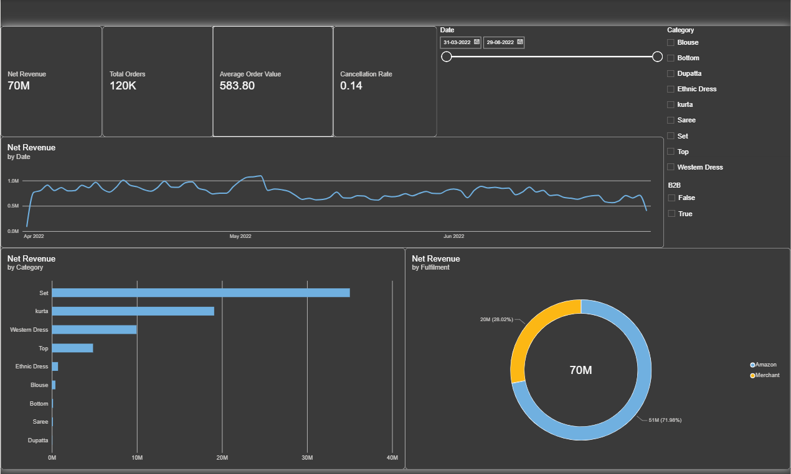

# Amazon E-Commerce Business Intelligence Dashboard

An interactive **Microsoft Power BI dashboard** analyzing Amazon India apparel sales to uncover revenue trends, product performance, geographic demand, fulfillment patterns, and cancellation behavior.

## 📊 Dashboard Preview



**Dashboard pages:**

* Executive Overview
* Geography Analysis
* Product Performance
* Fulfillment & Cancellations

See all dashboard screenshots in the [`screenshots`](screenshots/) folder.

---

## 🎯 Business Problem

The objective of this project was to transform raw Amazon e-commerce order data into an interactive business intelligence dashboard that helps answer:

1. Which categories and locations generate the most revenue?
2. What are the major product and fulfillment trends?
3. How significant are cancellations?
4. How does B2B performance compare with B2C?
5. Which states and cities represent the strongest demand?

---

## 🔍 Key Insights

* **Net Revenue:** ₹70,261,362 (~₹7.03 crore)
* **Orders:** 120,352
* **Overall Cancellation Rate:** ~14.3%
* **Top Revenue State:** Maharashtra
* **Business Mix:** Predominantly B2C
* Cancellation rates are distributed across major product categories rather than being concentrated in a single category.

---

## 📑 Dashboard Pages

| Page                            | Description                                                          |
| ------------------------------- | -------------------------------------------------------------------- |
| **Executive Overview**          | KPIs, revenue trends, category performance, and fulfillment overview |
| **Geography**                   | Revenue distribution across Indian states and cities                 |
| **Product Performance**         | Category revenue, units, size analysis, and product performance      |
| **Fulfillment & Cancellations** | Order status, cancellation analysis, and B2B vs B2C comparison       |

---

## 🗂️ Data

**Source:** Amazon Sale Report — public Kaggle dataset.

The project uses Amazon India apparel order data covering approximately **128,949 records** from March 31 to June 29, 2022.

### Repository data

* [`sample_sales_data.csv`](data/sample_sales_data.csv) — representative cleaned sample of the sales fact table.
* [`Dim_Date.csv`](data/Dim_Date.csv) — date dimension used for time-based analysis.

The full cleaned dataset is not included in the repository to keep the repository lightweight.

---

## 🧹 Data Cleaning

The raw dataset was prepared before loading into Power BI.

Key cleaning steps included:

* Removed the empty trailing column.
* Standardized `Ship State` and `Ship City` values.
* Corrected data types.
* Created an `Is Valid Order` flag.
* Preserved cancelled transactions for cancellation analysis.
* Prepared a dedicated date dimension for time intelligence.

---

## 🧩 Data Model

The dashboard uses a **star-schema approach** with a dedicated date dimension.

```text
Dim_Date (1) ──────────< (Many) Amazon_Sales_Fact

   Date                         Date
   Year                         Order ID
   Month Name                   Status
   Quarter                      Category
   Is Weekend                   Amount
                                Qty
                                ...
```

The date dimension supports time-intelligence calculations and period-based analysis.

---

## 🧮 DAX Measures

The project contains approximately **15 DAX measures** covering:

* Revenue
* Total Orders
* Average Order Value
* Cancellation Rate
* Delivery Rate
* Time Intelligence
* B2B vs B2C analysis

Full DAX documentation is available in [`DAX_Measures.md`](dax/DAX_Measures.md).

### Important DAX design decisions

**Total Orders**

Uses `DISTINCTCOUNT(Order ID)` rather than counting rows because a single order can contain multiple products or SKUs.

**Net Revenue**

Uses the `Is Valid Order` flag so cancelled transactions can be excluded from revenue while still remaining available for cancellation analysis.

---

## 🛠️ Tools & Technologies

* **Microsoft Power BI Desktop**
* **Power Query**
* **DAX**
* **Python**
* **Pandas**
* **CSV**
* **GitHub**

---

## 📁 Repository Structure

```text
amazon-sales-powerbi-dashboard/
│
├── README.md
├── Amazon_BI_Dashboard.pbix
│
├── data/
│   ├── sample_sales_data.csv
│   └── Dim_Date.cs_
```
